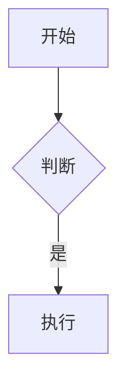

# vitepress-doc-site

将 Markdown 文件搭建为 VitePress 文档网站。

## 触发条件

- 用户说 "把这个项目的 markdown 文档搭成网页"
- 用户说 "帮我建个 VitePress 文档站"
- 用户说 "把 docs 目录用 web 方式展示"

## 功能

1. 检测 Node.js 环境，添加 vitepress、vitepress-plugin-mermaid、mermaid 到 devDependencies
2. 创建 `docs/package.json`（dev/build/preview 脚本，使用 `../node_modules/.bin/vitepress`）
3. 创建 `docs/.vitepress/config.ts`（导航、侧边栏），使用 `withMermaid()` 包装
4. 创建首页 `docs/index.md`（home layout）
5. 扫描现有 .md 文件自动生成侧边栏配置

## 输出结构

```
project/
├── package.json          # vitepress 在 devDependencies
├── docs/
│   ├── package.json       # docs 专属脚本
│   ├── index.md           # 首页
│   ├── .vitepress/
│   │   ├── config.ts      # 站点配置
│   │   └── theme/
│   │       └── index.ts   # 主题扩展
│   └── guide/             # 文档内容
```

## 启动

```bash
cd docs && npm run dev
```

## 示例

### 导航栏
```typescript
nav: [
  { text: '首页', link: '/' },
  { text: '指南', link: '/guide/' },
]
```

### 侧边栏（折叠组）
```typescript
sidebar: {
  '/guide/': [
    {
      text: '分组名',
      collapsed: false,
      items: [
        { text: '页面一', link: '/guide/page1' },
      ]
    },
  ],
}
```

### Mermaid 支持

内置：`vitepress-plugin-mermaid` + `withMermaid()` 包装 config。

````markdown

````
