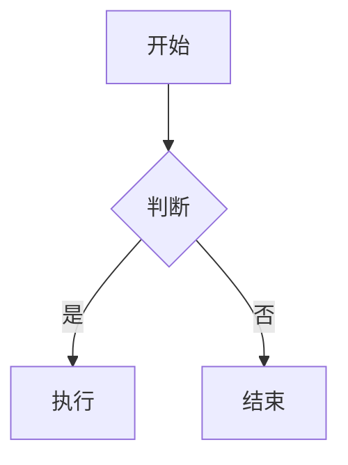

# VitePress 文档站

## Overview

VitePress 是 Vue 团队维护的静态站点生成器，将 Markdown 文件渲染为带导航侧边栏的文档网站。适合项目文档、需求文档、API 手册等场景。

## 项目结构

```
project/
├── package.json              # 项目依赖
├── .gitignore                # 排除 dist/ 和 cache/
└── docs/                     # 文档根目录
    ├── package.json           # docs 专属脚本（dev/build/preview）
    ├── index.md              # 首页（home layout）
    ├── guide/                # 文档内容
    │   ├── xxx.md
    │   └── subdir/
    └── .vitepress/
        ├── config.ts         # 站点配置（核心文件）
        └── theme/
            └── index.ts      # 主题扩展（注册全局组件）
```

## 快速搭建

### 0. 端口分配

搭建前先扫描已用端口，自动分配一个空闲端口。规则：

```bash
# 从 5173 开始，间隔 10，找第一个空闲端口
PORT=5173
while lsof -i :$PORT &>/dev/null; do PORT=$((PORT + 10)); done
echo $PORT
```

然后将端口写入 `docs/package.json` 的 dev 脚本。不同项目的文档站端口不会冲突。

### 1. 根目录 package.json

```json
{
  "devDependencies": {
    "vitepress": "^1.0.0",
    "vitepress-plugin-mermaid": "^2.0.0",
    "mermaid": "^11.0.0"
  }
}
```

### 2. docs/package.json

port 为第一步自动分配的端口号：

```json
{
  "scripts": {
    "dev": "../node_modules/.bin/vitepress dev . --host --port <port>",
    "build": "../node_modules/.bin/vitepress build .",
    "preview": "../node_modules/.bin/vitepress preview ."
  }
}
```

启动方式：

```bash
cd docs && npm run dev
```

### 3. 首页 (`docs/index.md`)

```markdown
---
layout: home
hero:
  name: "项目名称"
  text: "一句话描述"
  tagline: "副标题"
  actions:
    - theme: brand
      text: 开始阅读
      link: /guide/
    - theme: alt
      text: 其他入口
      link: /guide/other
features:
  - title: 特性一
    details: 描述
  - title: 特性二
    details: 描述
---
```

### 4. 配置 (`docs/.vitepress/config.ts`)

```typescript
import { defineConfig } from 'vitepress'
import { withMermaid } from 'vitepress-plugin-mermaid'

export default withMermaid(
  defineConfig({
    title: '站点标题',
    description: '站点描述',
    lang: 'zh-CN',
    ignoreDeadLinks: true,

    themeConfig: {
      outline: { level: [2, 3] },
      nav: [
        { text: '首页', link: '/' },
        { text: '指南', link: '/guide/' },
      ],
      sidebar: {
        '/guide/': [
          { text: '章节一', link: '/guide/page1' },
          { text: '章节二', link: '/guide/page2' },
        ],
      },
      footer: { message: '项目名称' },
    },
  })
)
```

`withMermaid()` 自动注入 Mermaid 支持，文档中可直接使用 ````mermaid` 代码块渲染流程图、时序图等。

### 5. 主题扩展 (`docs/.vitepress/theme/index.ts`)

```typescript
import DefaultTheme from 'vitepress/theme'

export default {
  extends: DefaultTheme,
  enhanceApp({ app }) {
    // 注册全局 Vue 组件
    // app.component('MyComponent', MyComponent)
  }
}
```

## 导航与侧边栏模式

### 折叠组（适用于分类场景）

```typescript
sidebar: {
  '/guide/': [
    {
      text: '分组名',
      collapsed: false,  // false=默认展开, true=默认折叠
      items: [
        { text: '页面一', link: '/guide/page1' },
        { text: '页面二', link: '/guide/page2' },
      ]
    },
  ],
}
```

### 路由前缀分组

不同目录自动匹配不同侧边栏：

```typescript
sidebar: {
  '/guide/a/': [ /* A 目录的侧边栏 */ ],
  '/guide/b/': [ /* B 目录的侧边栏 */ ],
}
```

### 外链

```typescript
{ text: '外部链接', link: 'https://example.com' }
```

## 常用定制

### 禁用暗色模式

```typescript
export default defineConfig({
  appearance: false,
})
```

### 自定义输出目录

```typescript
export default defineConfig({
  outDir: '../output/dist',
  base: '/dist/',
})
```

### 注入全局样式

```typescript
export default defineConfig({
  transformHead({ head }) {
    head.push(['style', {}, `自定义 CSS`])
  }
})
```

## Mermaid 图表支持

安装 `vitepress-plugin-mermaid` 和 `mermaid` 后，在 config.ts 中用 `withMermaid()` 包装即可。文档中直接使用：

````markdown

````

## .gitignore

```gitignore
node_modules/
docs/.vitepress/dist/
docs/.vitepress/cache/
```

## 常见问题

| 问题 | 解决 |
|------|------|
| 新增页面 404 | 确认 sidebar 中添加了对应的 link 条目 |
| sidebar 不显示 | 检查当前页面路径是否匹配 sidebar 的 key |
| 右侧目录不显示标题 | 确认 `outline.level` 包含对应标题级别 |
| markdown 链接失效 | 相对路径用 `./` 开头，或用根路径 `/guide/xxx` |
