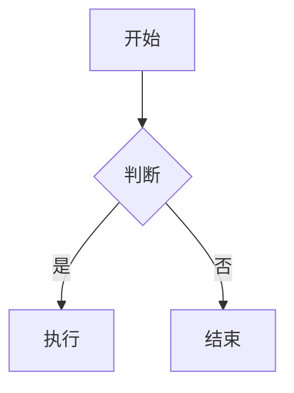

# VitePress 文档站

## Overview

VitePress 是 Vue 团队维护的静态站点生成器，将 Markdown 文件渲染为带导航侧边栏的文档网站。适合项目文档、需求文档、API 手册等场景。

## 项目结构

```
project/
├── package.json              # 项目依赖 + docs:* 脚本
├── .gitignore                # 排除 dist/ 和 cache/
└── docs/                     # 文档根目录
    ├── package.json           # docs 专属脚本（dev/build/preview）+ type:module
    ├── index.md              # 首页（home layout）
    ├── guide/                # 文档内容
    │   ├── xxx.md
    │   └── subdir/
    └── .vitepress/
        ├── config.ts         # 站点配置（核心文件）
        └── theme/
            ├── index.ts           # 主题扩展（引入 custom.css，setup() 调用 enhanceTables）
            ├── custom.css         # 内置能力样式：内容加宽 + 表格增强
            └── enhance-tables.ts  # 内置能力脚本：表格横滚 / ⤢ 弹窗最大化
```

## 快速搭建

### 0. 端口分配

搭建前先扫描已用端口，自动分配一个空闲端口。规则：

```bash
# 从 5173 开始，间隔 10，找第一个空闲端口
PORT=5173
while lsof -i :$PORT &>/dev/null; do PORT=$((PORT + 10)); done
echo $PORT
```

然后将端口写入 `docs/package.json` 的 dev 脚本。不同项目的文档站端口不会冲突。

**启动前必须检查单实例**（见"常见问题"第 1 条）：

```bash
# 若发现该 docs 目录已有 vitepress dev 进程，不要重复启动；先 kill 再启动
ps aux | grep "vitepress dev" | grep -v grep
```

### 1. 根目录 package.json

根目录提供 `docs:*` 脚本（用户可直接 `npm run docs:dev`）：

```json
{
  "scripts": {
    "docs:dev": "cd docs && npm run dev",
    "docs:build": "cd docs && npm run build",
    "docs:preview": "cd docs && npm run preview"
  },
  "devDependencies": {
    "vitepress": "^1.6.0",
    "vitepress-plugin-mermaid": "^2.0.17",
    "mermaid": "^11.0.0"
  }
}
```

### 2. docs/package.json

port 为第一步自动分配的端口号。**`"type": "module"` 必须有**，否则 config.ts 按 CJS 加载直接报错（见"常见问题"第 2 条）：

```json
{
  "type": "module",
  "scripts": {
    "dev": "../node_modules/.bin/vitepress dev . --host --port <port>",
    "build": "../node_modules/.bin/vitepress build .",
    "preview": "../node_modules/.bin/vitepress preview ."
  }
}
```

启动方式：

```bash
cd docs && npm run dev
```

### 3. 首页 (`docs/index.md`)

```markdown
---
layout: home
hero:
  name: "项目名称"
  text: "一句话描述"
  tagline: "副标题"
  actions:
    - theme: brand
      text: 开始阅读
      link: /guide/
    - theme: alt
      text: 其他入口
      link: /guide/other
features:
  - title: 特性一
    details: 描述
  - title: 特性二
    details: 描述
---
```

### 4. 配置 (`docs/.vitepress/config.ts`)

模板内置中文分词的站内搜索（local search），导航栏搜索框 / ⌘K 唤起，可搜菜单名与正文内容。**必须注入自定义分词**：VitePress 默认分词不支持中文（中文整句是单 token，永远搜不到）。

```typescript
import { defineConfig } from 'vitepress'
import { withMermaid } from 'vitepress-plugin-mermaid'

// 搜索分词：CJK 连续段二元切词（「中文分词」→ 中文/文分/分词；单字段保留单字），
// 拉丁/数字连续段按词保留（小写化）。VitePress 1.6.4 默认分词不支持中文，必须注入。
function tokenizeSearchText(text: string): string[] {
  const out: string[] = []
  const re = /[\p{Script=Han}぀-ヿ가-힯]+|[a-zA-Z0-9_]+/gu
  for (const m of text.matchAll(re)) {
    const s = m[0]
    if (/^[\p{Script=Han}぀-ヿ가-힯]/u.test(s)) {
      if (s.length === 1) {
        out.push(s)
      } else {
        for (let i = 0; i < s.length - 1; i++) out.push(s.slice(i, i + 2))
      }
    } else {
      out.push(s.toLowerCase())
    }
  }
  return out
}

export default withMermaid(
  defineConfig({
    title: '站点标题',
    description: '站点描述',
    lang: 'zh-CN',
    ignoreDeadLinks: true,

    vite: {
      optimizeDeps: {
        // 必需！withMermaid 不会自动预构建 mermaid 的 CJS 依赖，
        // 缺了 dev 模式白屏且 build 正常（极难排查，见"常见问题"第 3 条）
        include: ['fastdom', 'mermaid', 'mermaid/node_modules/dagre-d3-es'],
      },
    },

    themeConfig: {
      outline: { level: [2, 3] },
      search: {
        provider: 'local',
        options: {
          miniSearch: {
            options: {
              tokenize: tokenizeSearchText,
            },
          },
        },
      },
      nav: [
        { text: '首页', link: '/' },
        { text: '指南', link: '/guide/' },
      ],
      sidebar: {
        '/guide/': [
          { text: '章节一', link: '/guide/page1' },
          { text: '章节二', link: '/guide/page2' },
        ],
      },
      footer: { message: '项目名称' },
    },
  })
)
```

`withMermaid()` 自动注入 Mermaid 支持，文档中可直接使用 ````mermaid` 代码块渲染流程图、时序图等。

### 5. 主题扩展（内置能力：内容加宽 + 表格增强）

主题层内置两个开箱即用的能力，三份文件为固定模板，**新站点按源文件原样照抄**（源文件：sunbirder-skill-tools 仓库 `docs/.vitepress/theme/`）：

- **内容加宽**：破除 VitePress 双重宽度钳制（`--vp-layout-max-width` 版心 1440px 上限 + `.VPDoc.has-aside .content-container` 的 688px scoped 规则），≥960px 视口内容列占文档主区约 80%
- **表格增强**：所有 `.vp-doc` 表格横滚基线 + hover 右上角 ⤢ 按钮打开近全屏弹窗（95vw×90vh，ESC/遮罩/✕ 关闭），宽表列多时不再压缩展示

不需要这两个能力的站点，删除 `index.ts` 中的 `import './custom.css'`、`setup()` 及两个文件即可。

#### `docs/.vitepress/theme/index.ts`

```typescript
import DefaultTheme from 'vitepress/theme'
import { enhanceTables } from './enhance-tables'
import './custom.css'

export default {
  extends: DefaultTheme,
  setup() {
    enhanceTables()
  },
}
```

#### `docs/.vitepress/theme/custom.css` 与 `docs/.vitepress/theme/enhance-tables.ts`

两份文件全文较长（合计约 200 行，分节注释齐全），**从源仓库原样复制，不得凭记忆重写**——誊抄失真是真实发生过的坑。执行本技能时用 Read 工具读取源仓库文件内容，用 Write 工具写入新项目同路径。

## 导航与侧边栏模式

### 折叠组（适用于分类场景）

```typescript
sidebar: {
  '/guide/': [
    {
      text: '分组名',
      collapsed: false,  // false=默认展开, true=默认折叠
      items: [
        { text: '页面一', link: '/guide/page1' },
        { text: '页面二', link: '/guide/page2' },
      ]
    },
  ],
}
```

### 路由前缀分组

不同目录自动匹配不同侧边栏：

```typescript
sidebar: {
  '/guide/a/': [ /* A 目录的侧边栏 */ ],
  '/guide/b/': [ /* B 目录的侧边栏 */ ],
}
```

### 外链

```typescript
{ text: '外部链接', link: 'https://example.com' }
```

## 常用定制

### 禁用暗色模式

```typescript
export default defineConfig({
  appearance: false,
})
```

### 自定义输出目录

```typescript
export default defineConfig({
  outDir: '../output/dist',
  base: '/dist/',
})
```

### 注入全局样式

```typescript
export default defineConfig({
  transformHead({ head }) {
    head.push(['style', {}, `自定义 CSS`])
  }
})
```

## Mermaid 图表支持

安装 `vitepress-plugin-mermaid` 和 `mermaid` 后，在 config.ts 中用 `withMermaid()` 包装即可。文档中直接使用：

````markdown

```mermaid
graph TD
    A[开始] --> B{判断}
    B -->|是| C[执行]
    B -->|否| D[结束]
```
````

## .gitignore

```gitignore
node_modules/
docs/.vitepress/dist/
docs/.vitepress/cache/
```

## 常见问题

| 问题 | 解决 |
|------|------|
| 新增页面 404 | 确认 sidebar 中添加了对应的 link 条目 |
| sidebar 不显示 | 检查当前页面路径是否匹配 sidebar 的 key |
| 右侧目录不显示标题 | 确认 `outline.level` 包含对应标题级别 |
| markdown 链接失效 | 相对路径用 `./` 开头，或用根路径 `/guide/xxx` |
| 表格列太多显示不全 | 内置表格增强：原地横滚，或 hover 表格点右上角 ⤢ 打开全屏弹窗 |
| 站内搜索中文搜不到 | 模板已内置二元分词 tokenize；自写配置必须给 miniSearch 注入 tokenize，否则中文整句是单 token 永远搜不到 |

### 踩坑实录（必须逐条规避）

以下每条都真实踩过，排查成本高，按规范执行可直接规避。

#### 1. 双实例冲突 → 端口漂移 + 白屏

同一 docs 目录启动两个 `vitepress dev`（如 Agent 后台启动了一个、用户终端又启动一个），第二个实例自动跳到 `port+1`，但两者**共写同一份 `.vitepress/cache/`**，缓存损坏后两个实例都可能输出空壳页面。

**规范：**
- 启动前必查：`lsof -nP -i :<port> -sTCP:LISTEN` 和 `ps aux | grep "vitepress dev" | grep -v grep`
- 已有实例就不要再启动；需要重启时先 `pkill -f "vitepress dev"` 再清 `docs/.vitepress/cache/` 后启动
- 若发现端口漂移实例（如配置 5203 却跑在 5204），先杀掉全部实例再重启，不要在漂移实例上继续排查

#### 2. ESM 报错："ESM file cannot be loaded by `require`"

`docs/package.json` 缺 `"type": "module"` 时，config.ts 被按 CJS 加载，报：

```
✘ [ERROR] "vitepress" resolved to an ESM file. ESM file cannot be loaded by `require`.
```

**规范：** `docs/package.json` 必须含 `"type": "module"`。

#### 3. dev 白屏但 build 正常（最隐蔽）：optimizeDeps 缺 fastdom

`vitepress-plugin-mermaid` 的 `optimizeDeps.include` 没有包含 mermaid 的 CJS 依赖（`fastdom` 等）。dev 模式下浏览器直接加载原始 CJS 文件，报 `does not provide an export named 'default'`，Vue 应用不挂载，**页面白屏**；而 build 不走浏览器逐模块加载，**完全正常**。

**规范：** config.ts 必须加（见上文配置模板）：

```typescript
vite: {
  optimizeDeps: {
    include: ['fastdom', 'mermaid', 'mermaid/node_modules/dagre-d3-es'],
  },
},
```

修改 optimizeDeps 后必须清缓存重启：`rm -rf docs/.vitepress/cache`。

#### 4. curl 验证误导：HTTP 200 ≠ 页面正常

VitePress dev 是 SPA：curl 只能拿到约 450 字节的空壳 HTML（`<title></title>` + `<div id="app"></div>`），**无论页面是否真的能渲染都是 200**。用 curl 判断"页面正常"完全不可靠。

**验证分级：**

| 级别 | 手段 | 能证明什么 |
|------|------|-----------|
| L1 | `npm run docs:build` 成功 | config 语法正确、markdown 可编译（但 dev 白屏问题查不出） |
| L2 | 真浏览器（CDP）打开 + DOM 检查 | 页面真实可渲染、白屏/JS 错误可发现 |
| L3 | 浏览器检查 `.mermaid svg` 数量 | Mermaid 图真实渲染 |

**L2 是交付前的最低要求。** 交付文档站给用户前，必须用真实浏览器（如 CDP 打开页面后 eval `document.title` 与 `.vp-doc` 是否有内容）验证至少首页 + 一个含 mermaid 图的页面。禁止仅凭 curl 200 或 build 成功就宣布完成。

白屏时的排查顺序：①浏览器控制台/`import()` 逐模块加载定位报错；②`curl /@id/vitepress/config` 看 config 是否 500；③检查是否双实例/缓存损坏；④检查 optimizeDeps 是否含 fastdom。

#### 5. 批量生成文档 → 文件名不一致死链

多个并行 Agent 生成文档时，互相引用的文件名容易不一致（如 `workorder.md` vs `work-order.md` vs `orders.md`），产生大量死链。

**规范：**
- 生成前先确定**文件名清单**并在所有 Agent 的任务书中原样下发，禁止各 Agent 自行命名
- 交付前统一做死链扫描：

```bash
cd docs && find . -name '*.md' -not -path './node_modules/*' -print0 | while IFS= read -r -d '' f; do
  dir=$(dirname "$f")
  grep -oE '\]\([^)#]+\.md' "$f" 2>/dev/null | sed -E 's/\]\(//' | while read link; do
    if [ ! -f "$dir/$link" ]; then echo "DEAD: $f -> $link"; fi
  done
done | sort -u
```

输出必须为空才算完成。

#### 6. 依赖告警 "Failed to resolve dependency: debug"

启动日志出现 `Failed to resolve dependency: debug, present in 'optimizeDeps.include'`：安装 `npm i -D debug` 即可消除（mermaid 依赖链需要它）。
